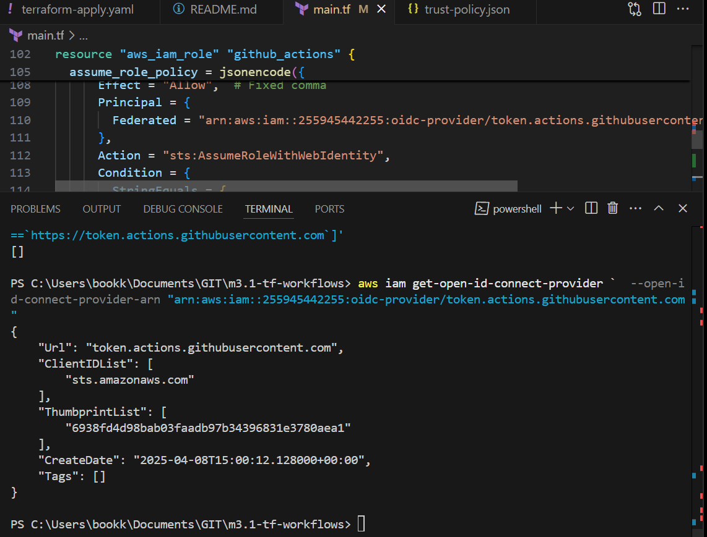

Before spinning, 
main.tf ln 6
# DELETE duplicate names s3 bucket "rgers3.tf-workflows" `overcome with local.name_prefix`
main.tf ln 90
# DELETE duplicate names IAM policy "TerraformLockTableAccess"

# check "aws_iam_user_policy" NOT USING, REPLACE WITH OIDC

Yes, switching to **OIDC (OpenID Connect) for GitHub Actions** would completely overcome this permission error because:

### Why OIDC Solves This
1. **Eliminates Static Credentials**  
   No need to:
   - Create IAM users for CI/CD
   - Manually rotate credentials
   - Handle `AttachUserPolicy`/`PutUserPolicy` permissions

2. **Short-Lived Tokens**  
   GitHub Actions receives temporary AWS credentials via AWS STS (`AssumeRoleWithWebIdentity`), avoiding long-term credential management.

3. **No More "Chicken-and-Egg" IAM Problems**  
   You won't need to grant `iam:PutUserPolicy` to Terraform-running users because:
   - The OIDC role is pre-configured with necessary permissions
   - Terraform executes with the role's permissions directly

---

### How to Implement OIDC
step-by-step repo here
https://github.com/KeenGWatanabe/oidc

#### 1. Add OIDC Provider to AWS (if not exists)
```hcl
data "aws_caller_identity" "current" {}

resource "aws_iam_openid_connect_provider" "github" {
  url             = "https://token.actions.githubusercontent.com"
  client_id_list  = ["sts.amazonaws.com"]
  thumbprint_list = ["6938fd4d98bab03faadb97b34396831e3780aea1"] # GitHub's OIDC thumbprint
}
```

#### 2. Create IAM Role (trust policy) for GitHub Actions
```hcl
resource "aws_iam_role" "github_actions" {
  name = "github-actions-role"

  assume_role_policy = jsonencode({
    Version = "2012-10-17"
    Statement = [{
      Effect = "Allow"
      Principal = {
        Federated = "arn:aws:iam::${data.aws_caller_identity.current.account_id}:oidc-provider/token.actions.githubusercontent.com"
      }
      Action = "sts:AssumeRoleWithWebIdentity"
      Condition = {
        StringEquals = {
          "token.actions.githubusercontent.com:aud" = "sts.amazonaws.com"
        }
        StringLike = {
          "token.actions.githubusercontent.com:sub" = "repo:your-org/your-repo:*"
        }
      }
    }]
  })
}
```

#### 3. Attach Policies to the Role (Not User)
```hcl
resource "aws_iam_role_policy_attachment" "terraform_lock_access" {
  role       = aws_iam_role.github_actions.name
  policy_arn = aws_iam_policy.terraform_lock_policy.arn
}
```
# checking provier exists cli:


Your workflow should now work if:
The IAM role's trust policy uses the `exact OIDC provider ARN`
GitHub repository name matches exactly (`case-sensitive`)
Workflow has `permissions: id-token: write`

# check CloudTrail events


# workflow error 
Run aws-actions/configure-aws-credentials@v4
  with:
    role-to-assume: arn:aws:iam::255945442255:role/github-actions-role
    aws-region: us-east-1
    role-session-name: github-actions-14345208543
    audience: sts.amazonaws.com
  env:
    AWS_REGION: us-east-1
    TF_WORKSPACE: 14345208543
Assuming role with OIDC
Error: Could not assume role with OIDC: Not authorized to perform sts:AssumeRoleWithWebIdentity


#### 4. Update GitHub Actions Workflow
```yaml
jobs:
  deploy:
    permissions:
      id-token: write   # Required for OIDC
      contents: read
    steps:
      - name: Configure AWS Credentials
        uses: aws-actions/configure-aws-credentials@v2
        with:
          role-to-assume: arn:aws:iam::123456789012:role/github-actions-role
          aws-region: us-east-1
```

---

### Key Benefits
1. **No More Permission Errors**  
   The role has predefined permissions—no runtime policy attachments needed.

2. **More Secure**  
   Temporary credentials expire automatically.

3. **Auditable**  
   CloudTrail logs show GitHub Actions as the source.

4. **Scalable**  
   Works across repositories without credential management.

---

### Migration Steps
1. Apply the OIDC Terraform changes **using an admin account** (or one with `iam:CreateRole` permissions).
2. Update your GitHub Actions workflow as shown above.
3. Remove static credentials from GitHub Secrets.

**Note:** The initial Terraform apply for `OIDC setup must be run by an admin or a user with elevated permissions`. After setup, `all subsequent runs use the OIDC role's permissions`.